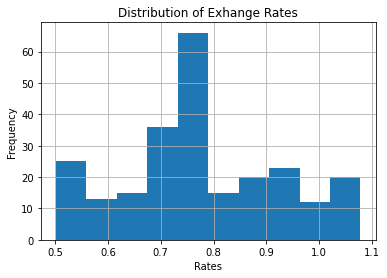
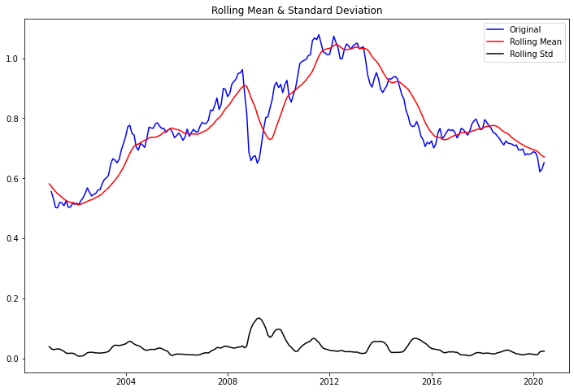
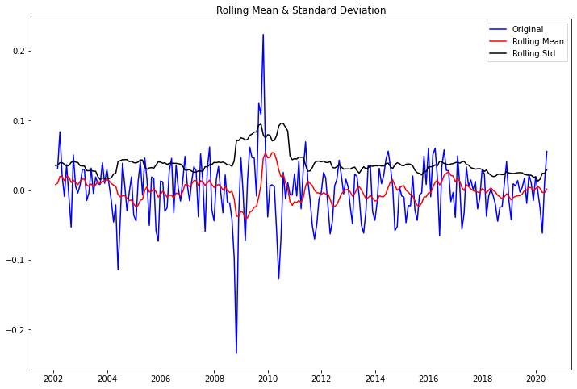
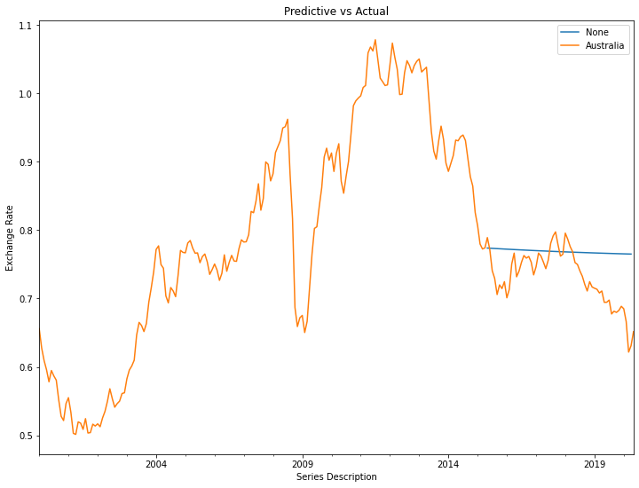
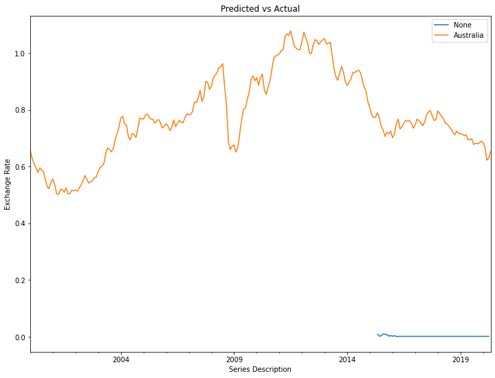
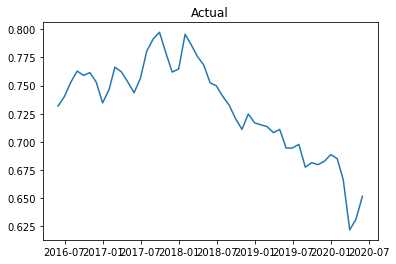
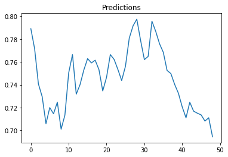
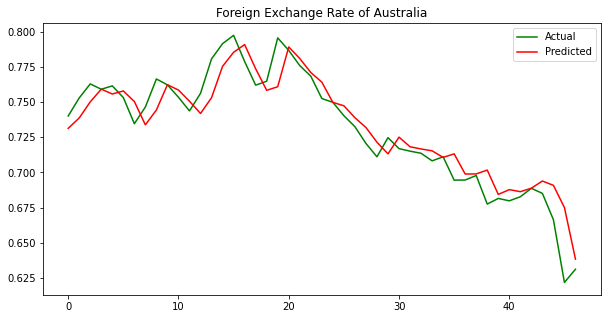

# Foreign Exchange Rates Time Series

## Background

The foreign exchange rate is based on the conversion of one coutries economy to anothers. Things that can factor into this are trade, economy, tourism and geo-political risk. Looking at the monthly exchange rates against the US dollar with other countries you can see when wars have broken out or economic calapes occured. After looking at the different countries I decided to try to preidct the foreign exchange between US and Australia. The main reason for this is becasue Australia has had the most consistent economy with the US, so hopefully we can come up with a good model for future predictions. 

## EDA

Looking at the distribution of exchange rates between the Australian and US dollar. 

The exchange rate between the Australian and US dollar from 01/2000-04/2020

Autocorralation and Partial Autocorralation
PAC drops off after 1 lag and begins to steady out after 2

## Forcasting

I used Dickey-Fuller tests to figure out the best way to make the data stationary. 

Orginal data was not stationary

Taking the 1st difference of the natural log made the data most stationary

I attempted a couple of different models to see which one would work the best. Using ARIMA model I looped through a list of parameters to determine what would be the best for p,d,q using the original data and the natural log of the first difference. 

Looking at Mean Squared Error and Absolute Mean Squared Error the best parameters were 1,0,0

The mean squared error for the original data ended up being 0.0027 which sounds great. Unfortunately the range for my data is 0.57565 so that little bit of a mean squared error makes a big difference when looking at the graph. 
The mean squared error for the natural log of the first difference was 0.53 making the original data better for the prediction model. 
I predicted the valuse from 5/2015 to 4/2020, graphing the predicted values to the actual values my predicted values was a constant slope and didn't look like the actual values. 

Graph of untouched data and predictions

Graph of 1st difference natural log and predictions

Next was a naive prediction, which ended up with a root mean squared error of .005

Finally was a LSTM that ended up with a root mean squared error of .0002

